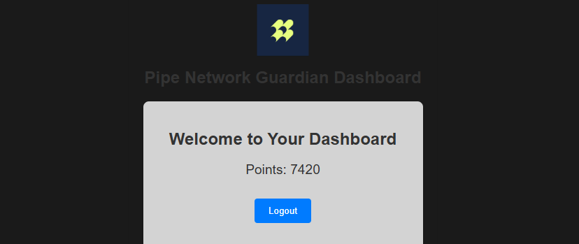
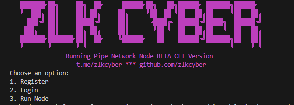

# Pipe Network Guardian

Pipe Network | The decentralized CDN redefining data delivery 🌍 | Faster bandwidth, lower latency ⚡ | Built on @Solana [https://pipecdn.app](https://pipecdn.app/signup?ref=bml1YWdyb0)
Pipe Network is taking decentralized content delivery to the next level with a two-tier node system that ensures high performance and reliability. PoP Nodes and Guardian Nodes. 🖥️📊

## and what we running here is Guardian Nodes📊



## Guardian Nodes 🛡️

Sitting above the PoP nodes, Guardian Nodes act like watchdogs. They continuously monitor network health, gather telemetry data, and optimize routing to ensure users get the fastest and most reliable data paths.

## How it Works 🔍

Guardian Nodes collect real-time metrics like latency, bandwidth, and uptime from PoP nodes.
With these insights, they can reroute traffic dynamically to avoid bottlenecks, improving overall network performance. 🚀

## OKE its enough for that intro , lets dive into the code. I will show you how to deploy a simple Guardian Node using CLI BETA VERSION

## Features

- **Register New Accounts**
- **Login To Existing Accounts**
- **Accounts Management**
- **Support Multy Accounts**
- **Support Proxy**

## Requirements

- **Node.js**: Ensure you have Node.js installed. Recommended version: 20+
- **Dependencies**: Install necessary dependencies with `npm install`.

## File Structure

- **account.json** it save your account info like email and password
- **proxy.txt** to store proxy you want to use, each line for 1 proxy `http://username:pass@ip:port`
- **token.json** it save access token after you login

## Setup

1. Clone this repository:
   ```bash
   git clone https://github.com/Zlkcyber/pipe-bot.git
   cd pipe-bot
   ```
2. Install dependencies:
   ```bash
   npm install
   ```
3. Run The Script: Make sure you already fill proxy in proxy.txt before start the bot
   ```bash
   npm run start
   ```
4. Follow the instructions in the terminal to complete the setup.
   - choose 1 to register new account.
   - you need login after you register accounts to get your access token.
   - choose 2 to login to account.
   - finally choose 3 to to run the bot.
     
